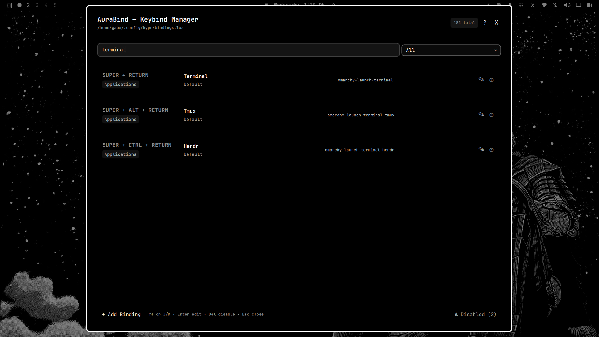

# AuraBind


An application for managing Hyprland keybindings on the fly with a robust searchable key selector.

Supports full key combinations (SUPER, CTRL, ALT, SHIFT + any key), a searchable binding list, and write-through to your `~/.config/hypr/bindings.lua` file using a managed fence block that coexists with hand-edited content.

## Previews
 >*App appearance updates in accordance with your applied system theme*

*Default screen showing the searchable binding list and action toolbar.*


*Example: searching for existing bindings with "terminal"*


*Edit binding panel with key assigning, description field, and action type selector.*


*View showing disabled keybindings in the list.*


## Features
- **Searchable key selector** — easily find and bind any standard, media, or mouse key via a searchable dropdown, completely avoiding Wayland global key interception issues.
- **Smart action types** — Execute Commands, Kill Active Window, run Lua/Dispatchers, open Web Apps, or Unbind (disable a default binding).
- **Search & filter** your bindings by category or text.
- **Conflict detection** — warns you before overriding an existing custom keybinding.
- **Disabled bindings manager** — easily view and re-enable default bindings you've previously disabled.
- **Vim-style navigation** — `j`/`k` to move, `Enter` to edit, `Delete` to remove, `Esc` to close.
- **Instant apply** — saves to `bindings.lua` and runs `hyprctl reload` automatically.
- **Error checking** — runs `hyprctl configerrors` after every reload to catch syntax mistakes.
- **Launcher registration** — accessible from `SUPER+SPACE` (Omarchy menu) and other desktop launchers.

---

## Installation

### Omarchy
```bash
omarchy plugin add https://github.com/ThatPikaga/AuraBind.git --enable
```
That's it. Adding the plugin clones it, validates it, and enables it in your bar/panel set.

**Manual install**

If `omarchy plugin add` isn't an option, clone the repo directly:
```bash
git clone https://github.com/ThatPikaga/AuraBind.git ~/.config/omarchy/plugins/thatpikaga.aurabind
```
Then force the shell to pick it up:
```bash
omarchy-shell shell rescanPlugins
omarchy plugin enable thatpikaga.aurabind
```

### General Install
If you are not using Omarchy, simply clone the repository directly into your home directory:
```bash
git clone https://github.com/ThatPikaga/AuraBind.git ~/AuraBind
```

---

## Updating

### Omarchy
```bash
omarchy plugin update thatpikaga.aurabind
```
This pulls the latest commit for the plugin. If a release changes QML component structure (noted in the release notes), do a full shell restart afterward so nothing is left running the old version in memory:
```bash
omarchy restart shell
```
For everyday updates a lighter rescan is usually enough:
```bash
omarchy-shell shell rescanPlugins
omarchy-shell shell reloadConfig
```

**Manual install**

If you installed by cloning directly into the plugins folder, update with a plain `git pull`:
```bash
cd ~/.config/omarchy/plugins/thatpikaga.aurabind
git pull
omarchy-shell shell rescanPlugins
```

### General Install
```bash
cd ~/AuraBind
git pull
```
Then relaunch `quickshell` (stop the running instance and start it again) to pick up the change.

> Your `~/.config/hypr/bindings.lua` and everything in it are untouched by an update — AuraBind only replaces its own plugin code, never your saved keybindings.

---

## Uninstalling

Removing AuraBind never touches your saved keybindings. Everything AuraBind has ever written lives inside the fenced block in `~/.config/hypr/bindings.lua`:
```
-- >>> aurabind managed keybindings block >>>
...
-- <<< aurabind managed keybindings block <<<
```
Uninstalling the plugin leaves that block in place as plain Hyprland Lua, so your bindings keep working exactly as before — Hyprland doesn't know or care whether AuraBind is still installed. The fence comments themselves are inert and harmless if you leave them; delete them by hand later only if you want a clean file.

### Omarchy
Use the plugin manager rather than deleting the folder yourself — this is what lets AuraBind clean up after itself properly (see below):
```bash
omarchy plugin remove thatpikaga.aurabind
```
This disables the plugin, unregisters it from the bar/panel set, and deletes its checkout under `~/.config/omarchy/plugins/`.

**Why not just `rm -rf` the plugin folder:** AuraBind registers its own launcher entry at `~/.local/share/applications/aurabind.desktop` the first time it loads, so it shows up in `SUPER+SPACE` without you having to wire up a keybind by hand. That entry is only removed when AuraBind gets a normal shutdown signal (disable/remove through the plugin manager, or a shell restart). If you delete the folder directly instead of using `omarchy plugin remove`, that file can be left behind. If that happens, you can safely remove it yourself — AuraBind only ever writes or deletes a file carrying its own marker, so this check keeps you from removing anything unrelated:
```bash
grep -l "X-AuraBind-Managed=true" ~/.local/share/applications/aurabind.desktop && \
  rm ~/.local/share/applications/aurabind.desktop
```

### General Install
```bash
rm -rf ~/AuraBind
```
The manual/standalone install doesn't register a launcher entry, so there's nothing else to clean up — deleting the folder is the whole uninstall.

---

## Usage
### Omarchy
Open AuraBind from the Omarchy menu (SUPER+SPACE) by searching "AuraBind", or toggle it from a terminal:
```bash
omarchy-shell shell toggle thatpikaga.aurabind
```

### General Usage
If you installed AuraBind to your home directory, navigate to the folder and launch the interface directly using Quickshell:
```bash
cd ~/AuraBind
quickshell
```
>Note: General usage requires a Wayland compositor with wlr-layer-shell support and Quickshell installed on your system.

---

### Adding a binding
Click + Add Binding at the bottom of the window.
- Toggle your desired Modifiers (SUPER, ALT, CTRL, SHIFT) and set the number of keys in the combo.
- Click the searchable dropdown and type to find your key (e.g., type "XF86" for media keys, or "SPACE").
- Enter a description and choose an Action type (Command, Kill Win, Lua/Dsp, Web App, or Unbind).
- Fill in the Action details (e.g., the terminal command or URL).
- Click Save.

### Editing
Tap the Edit (✎) button on any row, or highlight it and press Enter.

### Removing / Disabling
Tap the Disable (⊘) or Delete (✕) button, or highlight a row and press Delete/Backspace. Disabled default bindings can be restored later via the "⚠ Disabled" menu at the bottom right.

---

## Compatibility
Built for Hyprland. Requires `hyprctl` on your PATH.
