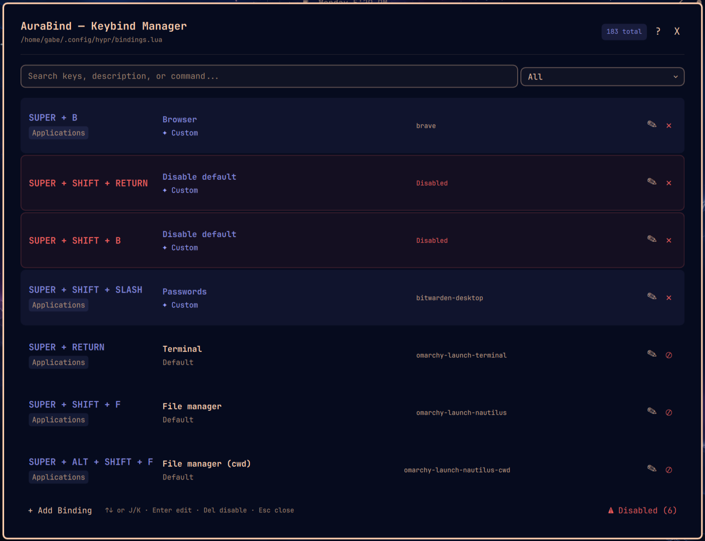
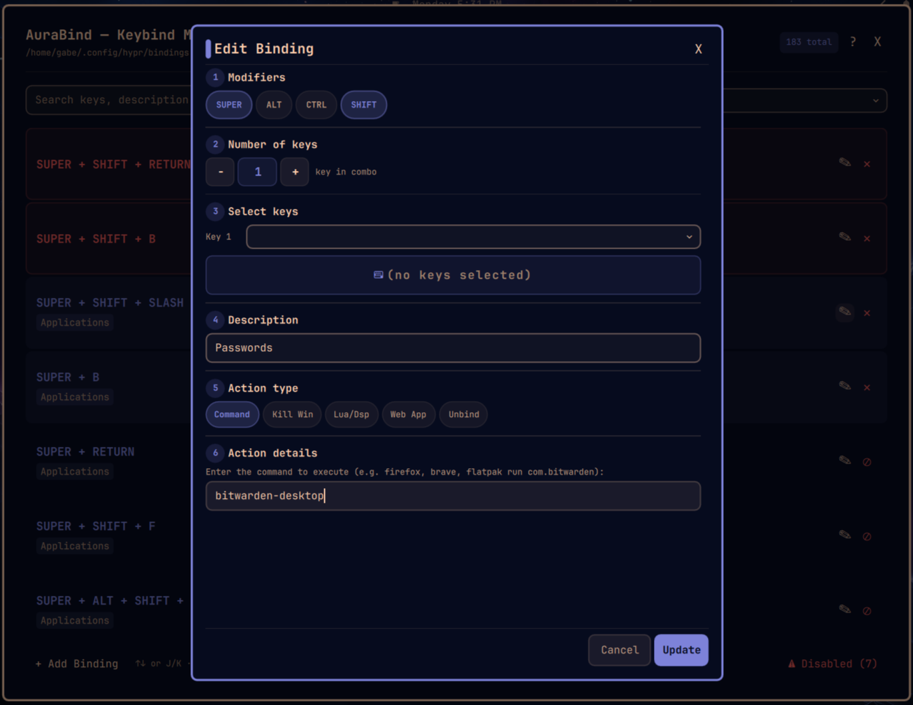
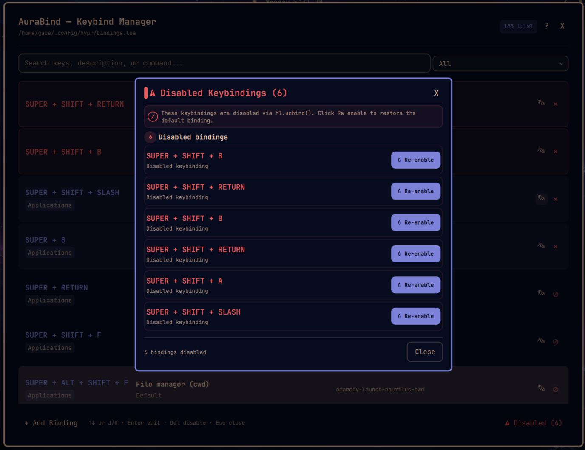

# AuraBind

An overlay for creating, editing, and deleting keybindings on the fly with live key capture.

Supports full key combinations (SUPER, CTRL, ALT, SHIFT + any key), a searchable binding list, and write-through to your `~/.config/hypr/bindings.lua` file using a managed fence block that coexists with hand-edited content.

## Features

- **Live key capture** — press any key combination to record it
- **Smart action types** — Open App, Custom Command, Start Plugin, Workspace, Kill Active, Reload, or Unbind (disable a default binding)
- **Search & filter** your bindings
- **Vim-style navigation** — `j`/`k` to move, `Enter` to edit, `Delete` to remove, `Esc` to close
- **Instant apply** — saves to `bindings.lua` and runs `hyprctl reload` automatically
- **Error checking** — runs `hyprctl configerrors` after every reload
- **Launcher registration** — accessible from SUPER+SPACE (Omarchy menu) and desktop launchers

## Installation

```bash
omarchy plugin clone thatpikaga.aurabind
```

That's it. Cloning switches the bar to your local copy and the panel becomes available.

### Manual install

If `omarchy plugin clone` isn't an option, clone the repo directly:

```bash
git clone https://github.com/ThatPikaga/AuraBind.git ~/.config/omarchy/plugins/thatpikaga.aurabind
```

Then force the shell to pick it up:

```bash
omarchy-shell shell rescanPlugins
```

## Usage

Open AuraBind from the Omarchy menu (SUPER+SPACE) by searching "AuraBind", or toggle it from a terminal:

```bash
omarchy-shell shell toggle thatpikaga.aurabind
```

### Adding a binding

1. Click **Add** (or navigate to an empty slot and press Enter)
2. Click **Click to capture** and press your desired key combination
3. Enter a description and choose an action type
4. Click **Save**

### Editing

Tap **Edit** on any row, or highlight it and press Enter.

### Removing

Tap **Del**, or highlight a row and press Delete/Backspace.

## Compatibility

Built for Omarchy. Requires `hyprctl` on your PATH (shipped with Hyprland).

## Previews



*Default screen showing the searchable binding list and action toolbar.*



*The Add/Edit binding panel with live key capture, description field, and action type selector.*



*View showing disabled keybindings in the list.*